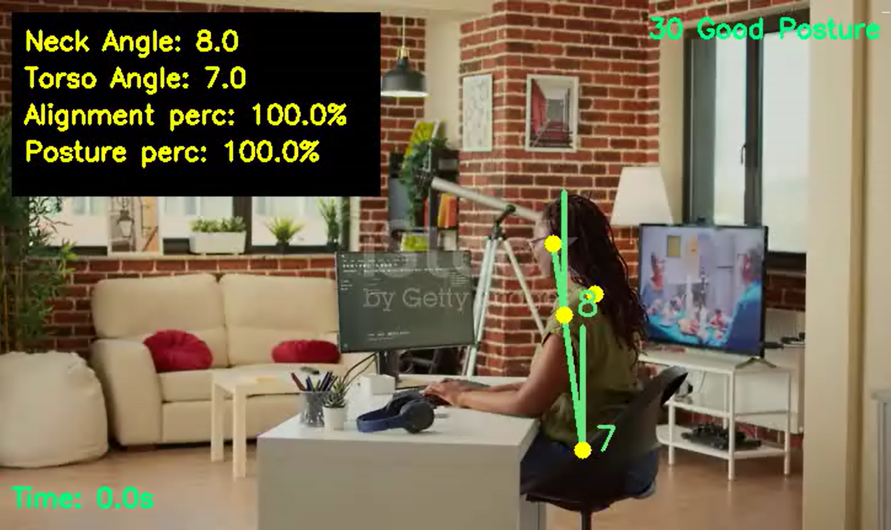

## Posture analysis using Mediapipe for human body posture correction

The goal is to detect a person from a perfect side view and measure the neck and torso inclination to some reference axis. By monitoring the inclination angle when the person bends below a certain threshold angle.

Other features include measuring the time of a particular posture and the camera alignment. We must ensure that the camera looks at the proper side view. Hence we require the alignment feature.

